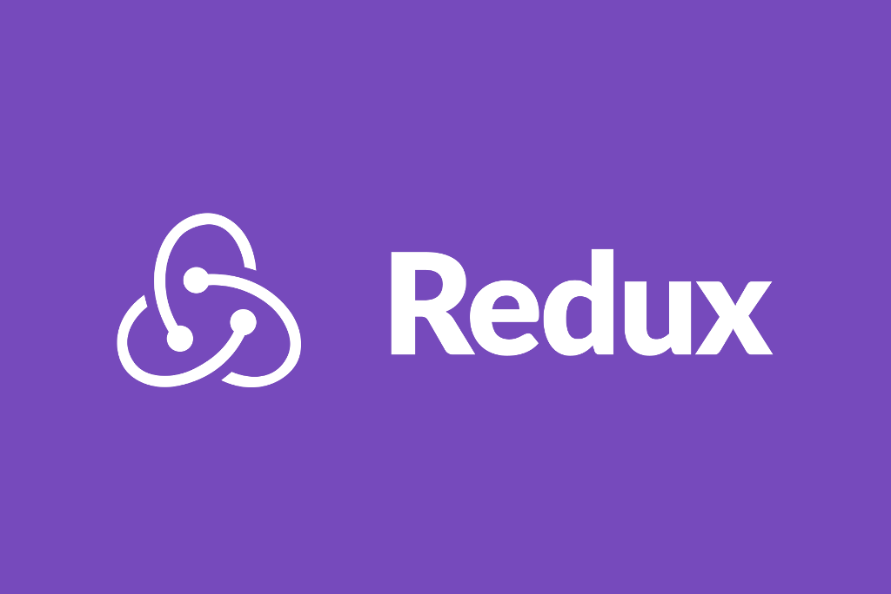
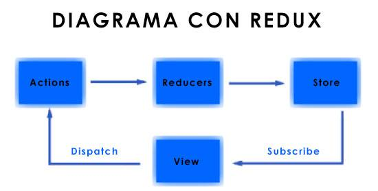

# 

 

# REDUX - CURSO NC DE REDUX

 

## TABLA DE CONTENIDO

- [Instalacion](#Instalacion)
- [Que es redux?](#Que-es-redux?)
- [Que es un manejador de estados](#Que-es-un-manejador-de-estados)
- [Que es una arquitectura](#Que-es-una-arquitectura)
- [Entonces sobre redux](#Entonces-sobre-redux)
- [Componentes redux](#Componentes-redux)
- [El Almacen ( Store )](#El-Almacen-(-Store-))
- [Los Reducers](#Los-Reducers)
- [Acciones](#Acciones)
- [Por que Redux](#Por-que-Redux)
    - [Rendimiento](#Rendimiento)
    - [Cambios claros](#Cambios-claros)
    - [Independiente de frameworks](#Independiente-de-frameworks)

 

## Instalacion

    Instalación

    Para instalar la versión estable:

        $ npm i -S redux

    Normalmente también vas a querer usar la conexión a React y las herramientas de desarrollo.

        $ npm i -S react-redux

        $ npm i -D redux-devtools

    Esto asumiendo que estás usando npm como administrador de paquetes con un empaquetador de módulos como Webpack o Browserify para usar módulos de CommonJS.

    Si todavía no usas npm o algún empaquetador de módulos moderno, quizás prefieras el paquete en UMD que define Redux como un objeto global, puedes usar una desde cdnjs. No recomendamos este enfoque para ninguna aplicación seria, ya que la mayoría de las librerías complementarias a Redux está solo disponibles en npm.

 

## Extensiones o Plugins

### Extension para Chrome

    - Redux DevTools

### Extension para Firefox

    - Redux DevTools

 

## Que es redux?

    - Redux es un contenedor predecible del estado de aplicaciones JavaScript.

        Para empezar, Redux no es ni un lenguaje, ni un framework, Redux es probablemente más una arquitectura basada en una librería cuyo trabajo es manejar el estado de tu aplicación.

        El concepto es bastante ambiguo, una arquitectura, un manejador de estados 🤷, por lo que para entender qué es Redux y lso beneficios de usarlo, pasamos a explicar estos conceptos primero.
        
        Te ayuda a escribir aplicaciones que se comportan de manera consistente, corren en distintos ambientes (cliente, servidor y nativo), y son fáciles de probar. Además de eso, provee una gran experiencia de desarrollo, gracias a edición en vivo combinado con un depurador sobre una línea de tiempo.

        Puedes usar Redux combinado con React, o cual cualquier otra librería de vistas. Es muy pequeño (2kB) y no tiene dependencias.

    - Influencias
    
        Redux evoluciona las ideas de Flux, pero evitando su complejidad tomando cosas de Elm.

        Ya sea que los hayas usado o no, solo toma unos minutos para empezar a usar Redux.

 

## Que es un manejador de estados

    - Las aplicaciones tienen un estado, este estado es la representación de la información y las modificaciones hechas a la misma, mientras la app se ejecuta. En general, el tema de manejar un estado para nuestra aplicación, está estrechamente relacionado con aplicaciones interactivas, donde precisamente la interacción del usuario modifica el estado de nuestra aplicación.

    Consideremos por ejemplo, el reproducto de vídeos de CódigoFacilito. Inicialmente, su estado es "detenido", cuando das clic en el botón Play, su estado pasa a "reproduciendo".

    Lo interesante del manejo del estado de una aplicación, es que por lo general, la modificación de una parte del estado, desencadena otras modificaciones. Si volvemos a considerar el ejemplo, podemos notar que si el estado del reproductor pasa a "reproduciendo", aparece un modal oscuro alrededor del reproductor que podríamos decir paso del estado "oculto" al estado "mostrar", por su parte se modifican otros valores como el contador del tiempo reproducido, la barra de progreso del vídeo, etc.

    Todo esto que cambia, mientras el usuario usa o interactúa con nuestra app, es el estado de nuestra aplicación, que inicia de una forma, pero conforme la interacción sucede va cambiando.

    Lo más importante por ahora, es que sepas que todas las aplicaciones manejan un estado, lo que cambia con Redux es cómo se maneja, más adelante hablaremos de esto.

 

## Que es una arquitectura

    - El concepto de arquitectura es mucho más simple de explicar, porque tiene una analogía directa. Tal como el arquitectura de un edificio que define cómo se construirá, bajo qué parámetros, qué consideraciones y respetando qué lineamientos... la arquitectura de una aplicación define estos mismos parámetros, lineamientos y consideraciones, es el cómo lo haremos en términos conceptuales, después, la implementación del programa, tiene que respetar estos lineamientos, es decir, seguir la arquitectura.

    Usamos arquitecturas para estandarizar el desarrollo, para que todas las partes de un programa estén alineadas entre sí, sean uniformes y concisas. Una arquitectura mejora el código que escribimos, la organización del proyecto, la identificación de bugs, nos facilita la toma de decisiones, porque ya no tenemos qué pensar cómo organizar un nuevo módulo o cómo atacar un problema, por lo general una buena arquitectura define estos lineamientos.

    Un problema de arquitectura, por ejemplo, puede ser ¿cómo se compartirán o se comunicarán distintos componetes del programa? ¿cómo pasamos información entre distintos módulos? ¿cómo manejamos el estado de nuestra app? ¿cómo separamos la lógica de la interfaz?

    Redux, precisamente, es una arquitectura que soluciona la comunicación y el flujo de información en la app.

 

## Entonces sobre redux

    - Redux es un manejador de estado, que guarda la información en una estructura JSON, y que nos permite compartirla a través de toda la aplicación, a esta información y sus cambios los identificamos como el estado de nuestra aplicación, por lo que en un resumen aún más conciso, Redux es un manejador del estado de nuestra aplicación.

    Sobre este manejador, se define la arquitectura Redux.

 

## Componentes redux

    - En Redux podemos identificar 3 principales actores y la Views o UI :

    El almacén
    Los reducers
    Las acciones

    Además de estos, tenemos otros conceptos también importantes como El estado, los Action Creators y los enhancers (como plugins)

    Flujo de redux con Subscribe & Dispatch :

    Todo el flujo de redux se hace en una sola via. ( Lo que hace que controlar toda la data sea mucho mas facil ). Todo se hace por medio de actions o acciones desencadenadas por el usuario o el programa que llevan a que los reducers cambien el estado dentro del Store y a su vez las views se alimentan de lo que hay en el store

 
 

## El Almacen ( Store )

    - El almacén es el objeto central, el almacén contiene el estado de nuestra aplicación y además los reducers que modificarán el estado de nuestra aplicación.

    En código, el almacen lo creamos con la función createStore, a la que le enviamos un reducer;

         $ const store = createStore(reducer);

 

## Los Reducers

    - Los reducers son funciones puras que modifican el estado de nuestra aplicación. Aquí hay que tener algo claro, el estado de nuestra aplicaicón no se modifica directamente, se modifica a través de los reducers.

    Un reducer usualmente se ve como a continuación:

        <Code>

        function user(state = {}, action){
        switch(action.type){
            case 'LOG_IN':
                return action.user;
                case 'LOG_OUT':
            return {};
                default:
            return state;
            }
        }

    Un reducer recibe una acción, otro de los conceptos importantes de Redux. en base a esta acción el Reducer define cómo debe modificar el estado, o si lo debe dejar como está. Cada reducer es una función, y cada función se encarga solo de una parte del estado.

    Si regresamos a nuestro ejemplo del reproductor de CódigoFacilito, tendríamos el reducer para el estado de reproducción (pausado/reproduciendo), el reducer para el vídeo en general (minutos reproducidos / progreso visto), etc. Para cada uno de ellos crearíamos un reducer separado.

 

## Acciones

    - Las acciones son objetos JSON que contendrán toda la información que necesitemos para modificar el estado.

    Para que un objeto JSON sea una acción válida, debe al menos contener una propiedad type que contenga una cadena que identifica el tipo de cambio que haremos, en el ejemplo anterior teníamos los tipos LOG_IN y LOG_OUT, para el ejemplo del reproductor podríamos tener los tipos PLAY, STOP, etc.

    Junto con la propiedad type, se añade la información adicional necesaria para modificar el estado. En el ejemplo anterior para poder hacer la modificación que identificamos como LOG_IN, añadimos al usuario que se autenticó para guardarlo en el almacén.

        <Code>

        // Propiedad type obligatoria
        switch(action.type){
            case 'LOG_IN':
                return action.user; // El usuario que inició sesión
            }

 

## Por que Redux

    - Entender una tecnología en muchas ocasiones requiere que primero sepamos ¿por qué o para qué? Por eso vamos a dedicarle gran parte del post a explicarte por qué usar Redux, cuáles son los beneficios para tu aplicación y por qué deberías aprender.

 
 

### Rendimiento

    - Todas las aplicaciones usan y manejan un estado, en desarrollo web por ejemplo, ese estado usualmente está controlado por el DOM.

    Por ejemplo, la representación del estado de un modal (si está abierto o cerrado) lo podemos saber si consultamos las clases que se aplicaron sobre dicho modal.

        <Code>

        <!--- Modal en estado abierto -->
        

        <!--- Modal en estado oculto/cerrado -->
        

    En otras ocasiones, para saber el estado de nuestra aplicación consultamos los controles de la interfaz:

        <Code>
        
        <input type='checkbox'  id='is_opened' />

        // Consultamos si el control está activo o no y modificamos la interfaz acorde
        document.querySelector('#is_opened').checked

    En otras ocasiones, el estado lo guardamos como propiedades de los elementos:

        <li data-id="1513"></li>

    Y aunque ninguno de estos enfoques está mal, el rendimiento tampoco es el ideal. Consultar el DOM en desarrollo web es costoso (toma tiempo o consume recursos), por lo que no es recomendable respaldarnos en el DOM para manejar el estado de nuestra aplicación.

    Redux por su parte es una estructura ligera de programación, por lo que obtener información y modificarla representa un costo muy muy bajo para nuestro programa.

    Por lo que la primer razón para usar Redux es: Mejor rendimiento.

### Cambios claros 

    - Independientemente de cuál sea el almacén para el estado de tu aplicación, necesitas uno. Definir un almacén es darle respuesta a varias preguntas de arquitectura, por ejemplo: ¿cómo se compartirán o se comunicarán distintos componetes del programa? ¿cómo pasamos información entre distintos módulos? ¿cómo manejamos el estado de nuestra app? ¿cómo separamos la lógica de la interfaz?

    Cuando no hay un almacén para la aplicación, las modificaciones se hace arbitrariamente, de formas no uniformes ni concisas, por lo que en caso de que haya un bug, rastrear quién está haciendo la modificación puede ser imposible.

    ¿La modificación viene de una librería, de un componente, del usuario, de la aplicación, de un timer, de dónde?

    Redux le da consistencia y uniformidad a los cambios proveyéndonos de un almacén central, que además, tiene una forma bien definida para realizar modificaciones (usando acciones y reducers).

    Redux, además, está fundamentado en la programación funcional, toma conceptos como Inmutabilidad y Funciones Puras, que en palabras muy resumidas, hacen las modificaciones al estado muy claras y concisasas, de manera que rastrear de dónde viene una modificación es muy muy simple.

    La segunda razón para usar Redux es: Cambios claros, concisos y una manera uniforme de hacer dichos cambios.

### Independiente de frameworks

    - Aunque la popularidad de Redux está estrechamente ligada a la comunidada de React, porque es en aplicaciones de React donde más comúnmente nos topamos con Redux, la idea de Redux y la librería central que hace funcionar todo lo que aquí hemos hablado, no depende de ningún framework.

    Puedes usar Redux en Angular, en Vue, en React Native, en React, etc.

    Lo interesante de esto es que con esto no solo llevas la librería a otros frameworks, si no también la arquitectura, los conceptos, y la forma de solucionar problemas. Es reciclar conocimiento que puedes llevar a todas partes.

    La tercera razón para usar Redux es: Puedes usar Redux en cualquier proyecto, sin importar el framework.

 

## Cuando usar redux

    - Aconsejable cuando tenemos un proyecto que sabemos que va a crecer y que en cierto momento sabemos que el flujo de los estados puede empezar a convertirce en un problema.

    - Cuando la aplicacion es pequeña no seria necesario. Con los que nos ofrece el framework visual bastaria. 

    - Tambien se puede migrar un proyecto que no este aplicado redux. O se le puede aplicar a un aparte del proyecto y el resto que quede como estaba, O ir migrando poco a poco.

